# DM_CRM Sales Dashboard - Data Model Documentation

## Table of Contents
1. [Overview](#overview)
2. [Entity Relationship Diagram](#entity-relationship-diagram)
3. [Core Entities](#core-entities)
4. [Relationship Details](#relationship-details)
5. [Database Schema Tables](#database-schema-tables)
6. [Business Process Flow](#business-process-flow)
7. [Data Integrity & Constraints](#data-integrity--constraints)

## Overview

The DM_CRM Sales Dashboard is built on a comprehensive PostgreSQL database designed for B2B consulting and service companies, with specialized support for pharmaceutical industry workflows. The system provides enterprise-grade authentication, project management, customer relationship management, and data integration capabilities.

## Entity Relationship Diagram

```mermaid
erDiagram
    %% Core Business Entities
    USERS {
        string id PK "Primary Key"
        string email UK "Unique Email"
        string name
        string role "Admin|Manager|Viewer"
        string password_hash
        boolean is_active
        timestamp last_login
        timestamp created_at
        timestamp updated_at
    }

    CUSTOMERS {
        string id PK "Primary Key"
        string name "NOT NULL"
        string phase "Business Phase"
        date contract_start_date
        date contract_end_date
        string logo_url
        string avatar_color
        boolean active
        timestamp inactivated_at
        timestamp created_at
        timestamp updated_at
    }

    CONTACTS {
        string id PK "Primary Key"
        string customer_id FK "NULL for Internal"
        string name
        string email
        string phone
        string title
        string role
        string type "Client|Internal|Vendor|Partner"
        timestamp created_at
        timestamp updated_at
    }

    PROCESSES {
        string id PK "Primary Key"
        string customer_id FK "NOT NULL"
        string responsible_contact_id FK
        string tpa_responsible_contact_id FK
        string name
        string description
        string jira_ticket
        string status "Not Started|In Progress|Completed"
        string sdlc_stage "Requirements|Design|Development|Testing|Deployment|Maintenance"
        date start_date
        date due_date
        string approval_status
        integer estimate "Hours"
        string functional_area
        integer progress "0-100"
        boolean is_tpa_required
        string tpa_data_source
        date tpa_start_date
        date tpa_end_date
        timestamp created_at
        timestamp updated_at
    }

    TEAMS {
        string id PK "Primary Key"
        string customer_id FK "NOT NULL"
        string name
        string finance_code
        date start_date
        date end_date
        timestamp created_at
        timestamp updated_at
    }

    SERVICES {
        string id PK "Primary Key"
        string customer_id FK "NOT NULL"
        string name
        integer monthly_hours
        timestamp created_at
        timestamp updated_at
    }

    DOCUMENTS {
        string id PK "Primary Key"
        string customer_id FK "NOT NULL"
        string name
        string description
        string category "Contract|Proposal|Requirements|Design|Technical|Report|Invoice|Other"
        string file_url
        integer file_size
        string mime_type
        timestamp created_at
        timestamp updated_at
    }

    %% Process Management Enhancement
    PROCESS_TASKS {
        uuid id PK "Primary Key"
        string process_id FK "CASCADE DELETE"
        uuid parent_task_id FK "CASCADE DELETE"
        string assigned_to_id FK "SET NULL"
        string title
        string description
        string status "Not Started|In Progress|Completed|Blocked"
        string priority "Low|Medium|High"
        date due_date
        date completed_date
        timestamp created_at
        timestamp updated_at
    }

    PROCESS_MILESTONES {
        uuid id PK "Primary Key"
        string process_id FK "CASCADE DELETE"
        string milestone_type "Requirements Complete|Requirements Approved External|Requirements Approved Internal|Estimate Provided|Sprint Confirmed|UAT Started|UAT Approved|Deployment Date|Production Release Date"
        date achieved_date
        string notes
        timestamp created_at
        timestamp updated_at
    }

    PROCESS_TEAM {
        uuid id PK "Primary Key"
        string process_id FK "CASCADE DELETE"
        string team_id FK "CASCADE DELETE"
        timestamp created_at
    }

    %% Data Integration & Automation
    PROCESS_FILE_TRANSFERS {
        uuid id PK "Primary Key"
        string process_id FK "CASCADE DELETE"
        string name
        string connection_type "SFTP|S3|ADLS|FTP|HTTP|Local"
        string direction "Inbound|Outbound"
        string file_pattern
        string schedule_type "Manual|Hourly|Daily|Weekly|Monthly"
        string host
        integer port
        string username
        string credential_reference
        string remote_path
        string local_path
        boolean is_active
        timestamp created_at
        timestamp updated_at
    }

    PROCESS_NOTIFICATIONS {
        uuid id PK "Primary Key"
        string process_id FK "CASCADE DELETE"
        string recipient_name
        string recipient_email
        string recipient_role
        json event_types "Array of subscribed event types"
        boolean is_active
        timestamp created_at
        timestamp updated_at
    }

    %% Customer Relationship Management
    CUSTOMER_NOTES {
        uuid id PK "Primary Key"
        string customer_id FK "CASCADE DELETE"
        string title
        string content
        boolean active
        timestamp created_at
        timestamp updated_at
        timestamp deleted_at
    }

    CUSTOMER_IMPORTANT_DATES {
        uuid id PK "Primary Key"
        string customer_id FK "CASCADE DELETE"
        string title
        string description
        date date
        boolean active
        timestamp created_at
        timestamp updated_at
        timestamp deleted_at
    }

    %% Junction Tables
    CONTACT_CUSTOMER_ASSIGNMENTS {
        string contact_id FK "Composite PK"
        string customer_id FK "Composite PK"
        timestamp created_at
    }

    %% Pharmaceutical Industry Specialization
    PHARMACEUTICAL_PRODUCTS {
        uuid id PK "Primary Key"
        string team_id FK "CASCADE DELETE"
        string product_name
        string ndc_number
        string therapeutic_area "Oncology|Cardiology|Neurology|Endocrinology|Immunology|Infectious Disease|Gastroenterology|Respiratory|Dermatology|Ophthalmology|Psychiatry|Rheumatology|Urology|Other"
        string drug_class "Monoclonal Antibody|Small Molecule|Biologic|Vaccine|Gene Therapy|Cell Therapy|Peptide|Protein|Nucleic Acid|Medical Device|Combination Product|Other"
        string indication
        string regulatory_status "Approved|Phase III|Phase II|Phase I|Pre-clinical|Discovery|Discontinued|Withdrawn"
        timestamp created_at
        timestamp updated_at
    }

    %% Communication & Activity Tracking
    COMMUNICATIONS {
        string id PK "Primary Key"
        string contact_id FK "NOT NULL"
        string type "email|phone|meeting|other"
        string subject
        string notes
        date date
        timestamp created_at
        timestamp updated_at
    }

    TIMELINE_EVENTS {
        string id PK "Primary Key"
        string customer_id FK "Optional"
        string process_id FK "Optional"
        string event_type
        string title
        string description
        json metadata
        timestamp created_at
    }

    %% AI Integration
    AI_CHAT_SESSIONS {
        string id PK "Primary Key"
        string user_id FK "NOT NULL"
        string title
        string model
        string system_prompt
        timestamp created_at
        timestamp updated_at
    }

    AI_CHAT_MESSAGES {
        string id PK "Primary Key"
        string session_id FK "NOT NULL"
        string role "user|assistant"
        string content
        timestamp created_at
    }

    %% Authentication & Security
    ROLES {
        uuid id PK "Primary Key"
        string name UK "Unique Name"
        string description
        json permissions
        timestamp created_at
        timestamp updated_at
    }

    USER_ROLES {
        uuid id PK "Primary Key"
        string user_id FK "CASCADE DELETE"
        uuid role_id FK "CASCADE DELETE"
        string assigned_by FK "NOT NULL"
        timestamp created_at
    }

    USER_SESSIONS {
        uuid id PK "Primary Key"
        string user_id FK "CASCADE DELETE"
        string session_token UK "Unique Token"
        string refresh_token UK "Unique Token"
        timestamp expires_at
        timestamp last_used
        string ip_address
        string user_agent
        timestamp created_at
    }

    AUDIT_LOGS {
        uuid id PK "Primary Key"
        string user_id FK "Optional"
        string action
        string resource_type
        string resource_id
        json old_values
        json new_values
        string ip_address
        string user_agent
        timestamp created_at
    }

    %% Relationships
    CUSTOMERS ||--o{ CONTACTS : "has"
    CUSTOMERS ||--o{ TEAMS : "has"
    CUSTOMERS ||--o{ SERVICES : "has"
    CUSTOMERS ||--o{ PROCESSES : "has"
    CUSTOMERS ||--o{ DOCUMENTS : "has"
    CUSTOMERS ||--o{ CUSTOMER_NOTES : "has"
    CUSTOMERS ||--o{ CUSTOMER_IMPORTANT_DATES : "has"
    CUSTOMERS ||--o{ TIMELINE_EVENTS : "relates to"

    PROCESSES ||--o{ PROCESS_TASKS : "contains"
    PROCESSES ||--o{ PROCESS_MILESTONES : "has"
    PROCESSES ||--o{ PROCESS_FILE_TRANSFERS : "configures"
    PROCESSES ||--o{ PROCESS_NOTIFICATIONS : "sends"
    PROCESSES ||--o{ TIMELINE_EVENTS : "generates"

    CONTACTS ||--o{ COMMUNICATIONS : "participates in"
    CONTACTS ||--o{ PROCESS_TASKS : "assigned to"
    CONTACTS ||--o{ PROCESSES : "responsible for"

    TEAMS ||--o{ PHARMACEUTICAL_PRODUCTS : "manages"

    PROCESS_TASKS ||--o{ PROCESS_TASKS : "contains subtasks"

    %% Many-to-Many Relationships
    CONTACTS ||--o{ CONTACT_CUSTOMER_ASSIGNMENTS : "assigned to"
    CUSTOMERS ||--o{ CONTACT_CUSTOMER_ASSIGNMENTS : "has assigned"
    PROCESSES ||--o{ PROCESS_TEAM : "assigned to"
    TEAMS ||--o{ PROCESS_TEAM : "works on"

    %% User Authentication
    USERS ||--o{ USER_SESSIONS : "has"
    USERS ||--o{ USER_ROLES : "has"
    USERS ||--o{ AI_CHAT_SESSIONS : "creates"
    USERS ||--o{ AUDIT_LOGS : "performs"
    ROLES ||--o{ USER_ROLES : "granted to"

    %% AI System
    AI_CHAT_SESSIONS ||--o{ AI_CHAT_MESSAGES : "contains"
```



## Core Entities

### 1. **Customer Management Hub**
- **CUSTOMERS**: Central business entity representing client companies
- **CONTACTS**: People associated with customers or internal staff
- **TEAMS**: Resource groups assigned to customers with finance codes
- **SERVICES**: Service agreements with monthly hour allocations

### 2. **Process & Project Management**
- **PROCESSES**: Main project/workflow entities with SDLC tracking
- **PROCESS_TASKS**: Hierarchical task management with assignments
- **PROCESS_MILESTONES**: Predefined project milestones tracking
- **PROCESS_TEAM**: Many-to-many team assignments to processes

### 3. **Data Integration & Automation**
- **PROCESS_FILE_TRANSFERS**: File transfer configurations (SFTP, S3, ADLS, etc.)
- **PROCESS_NOTIFICATIONS**: Event-driven notification recipients
- **TIMELINE_EVENTS**: Activity audit trail across the system

### 4. **Industry Specialization**
- **PHARMACEUTICAL_PRODUCTS**: Drug/product tracking with regulatory status
- **COMMUNICATIONS**: Interaction history with contacts
- **DOCUMENTS**: File management with categorization

### 5. **Authentication & Security**
- **USERS**: User accounts with role-based authentication
- **ROLES**: Role definitions with JSON permissions
- **USER_SESSIONS**: JWT session management
- **AUDIT_LOGS**: Security and change audit trail

### 6. **AI Integration**
- **AI_CHAT_SESSIONS**: Conversational AI sessions
- **AI_CHAT_MESSAGES**: Chat message history

## Relationship Details

### Primary Relationships (1:N)


### Many-to-Many Relationships


### Hierarchical Relationships


## Database Schema Tables

### Authentication & User Management
| Table | Purpose | Key Features |
|-------|---------|--------------|
| `users` | User accounts | JWT authentication, role-based access, account lockout |
| `roles` | Role definitions | JSON permissions, hierarchical access |
| `user_roles` | User-role assignments | Many-to-many with audit trail |
| `user_sessions` | Session management | JWT tokens, session tracking |
| `audit_logs` | Security audit | Change tracking, IP logging |

### Core Business Entities
| Table | Purpose | Key Features |
|-------|---------|--------------|
| `customers` | Client companies | Contract lifecycle, soft delete, branding |
| `contacts` | People management | Multi-type contacts, flexible assignments |
| `teams` | Resource groups | Finance code billing, date ranges |
| `services` | Service agreements | Monthly hour allocations |
| `documents` | File management | Category-based organization, metadata |

### Process & Project Management
| Table | Purpose | Key Features |
|-------|---------|--------------|
| `processes` | Main projects | SDLC stages, TPA support, approval workflow |
| `process_tasks` | Task tracking | Hierarchical structure, assignments, priorities |
| `process_milestones` | Project milestones | Predefined types, achievement tracking |
| `process_team` | Team assignments | Many-to-many process-team relationships |

### Data Integration & Automation
| Table | Purpose | Key Features |
|-------|---------|--------------|
| `process_file_transfers` | File movement config | Multi-protocol support, scheduling |
| `process_notifications` | Event notifications | Recipient management, event subscriptions |
| `timeline_events` | Activity tracking | System-wide audit trail |

### Customer Relationship Management
| Table | Purpose | Key Features |
|-------|---------|--------------|
| `customer_notes` | Relationship notes | Soft delete, structured content |
| `customer_important_dates` | Milestone tracking | Date-based reminders |
| `communications` | Interaction history | Multi-channel communication tracking |

### Industry Specialization
| Table | Purpose | Key Features |
|-------|---------|--------------|
| `pharmaceutical_products` | Drug/product tracking | Regulatory status, therapeutic areas |
| `contact_customer_assignments` | Flexible contact assignments | Many-to-many relationships |

### AI Integration
| Table | Purpose | Key Features |
|-------|---------|--------------|
| `ai_chat_sessions` | AI conversations | Model configuration, system prompts |
| `ai_chat_messages` | Chat history | Role-based message tracking |

## Business Process Flow

### 1. Customer Onboarding Flow


### 2. Project Management Flow


### 3. Data Integration Flow


## Data Integrity & Constraints

### Foreign Key Relationships
- **CASCADE DELETE**: Process-related tables cascade when process is deleted
- **SET NULL**: Task assignments become null when contact is deleted
- **RESTRICT**: Customers cannot be deleted if they have active processes

### Unique Constraints
- User emails must be unique across the system
- Milestone types are unique per process
- Session tokens must be globally unique
- User-role assignments prevent duplicates

### Check Constraints
- Process progress must be between 0-100
- Contract end date must be after start date
- Task due dates must be in the future for new tasks
- Self-referencing prevention in hierarchical structures

### Indexes for Performance
```sql
-- Strategic indexes for common queries
CREATE INDEX idx_customers_active ON customers(active);
CREATE INDEX idx_processes_customer_status ON processes(customer_id, status);
CREATE INDEX idx_tasks_process_status ON process_tasks(process_id, status);
CREATE INDEX idx_timeline_customer_date ON timeline_events(customer_id, created_at);
CREATE INDEX idx_sessions_token ON user_sessions(session_token);
CREATE INDEX idx_audit_user_date ON audit_logs(user_id, created_at);

-- Composite indexes for junction tables
CREATE INDEX idx_contact_customer_assignments ON contact_customer_assignments(contact_id, customer_id);
CREATE INDEX idx_process_team_assignments ON process_team(process_id, team_id);

-- JSONB indexes for metadata
CREATE INDEX idx_notifications_event_types ON process_notifications USING GIN(event_types);
CREATE INDEX idx_roles_permissions ON roles USING GIN(permissions);
```

### Data Validation Rules
- Email format validation for users and contacts
- Phone number format standardization
- File size limits for document uploads
- Progress percentage validation (0-100)
- Date range validation for contracts and projects

---

## Summary

This data model provides a comprehensive foundation for:

1. **Customer Relationship Management** - Complete customer lifecycle tracking
2. **Project Management** - Hierarchical task management with team assignments
3. **Data Integration** - Automated file transfers and notifications
4. **Industry Specialization** - Pharmaceutical product and regulatory tracking
5. **Security & Audit** - Enterprise-grade authentication and audit trails
6. **AI Integration** - Conversational AI with context awareness

The design emphasizes data integrity, performance optimization, and scalability while maintaining flexibility for diverse business requirements in the B2B consulting and pharmaceutical industries.